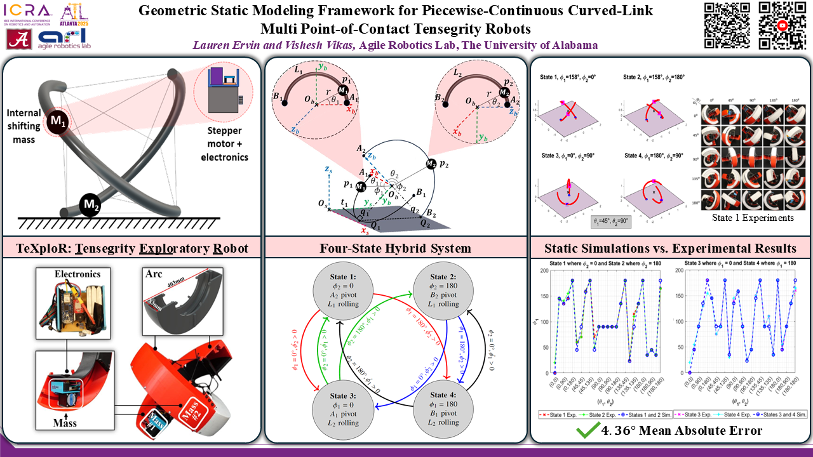
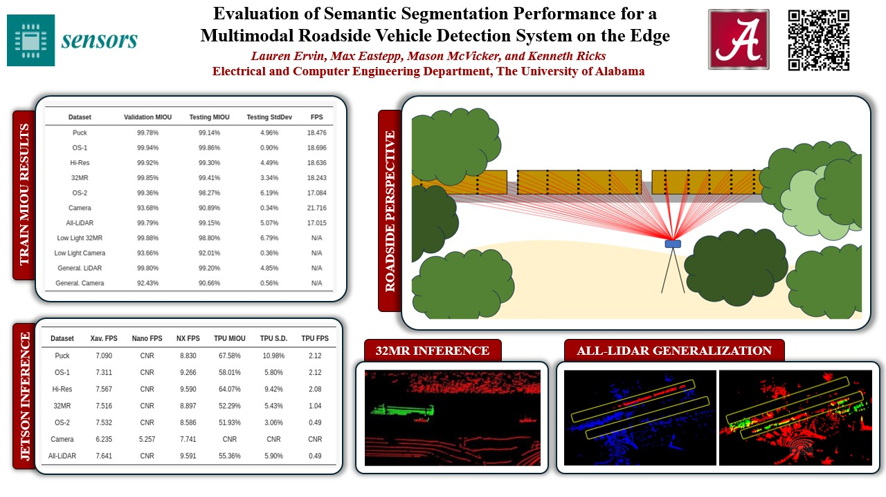
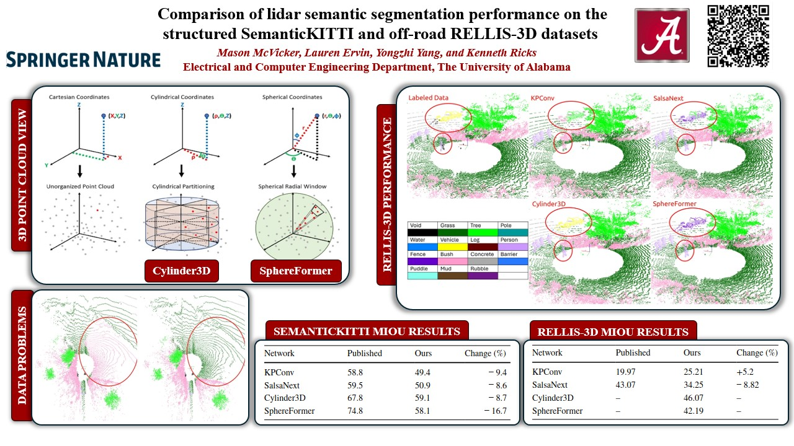
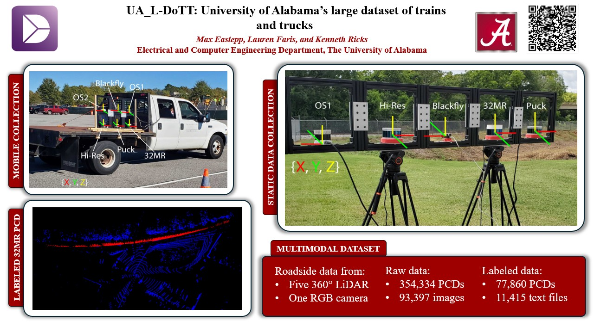

I'm currently a Visiting Assistant Professor in the Electrical and Computer Engineering Department at Florida 
International University in Miami, Florida.  Since [joining the department](https://ece.fiu.edu/people/faculty/profiles/lauren-ervin/index1.html) in August 2025, I have been knee-deep in research, proposal 
writing, crafting new robotics and computer vision undergraduate/graduate courses, and mentoring students.  My 
current research interests lie at the intersection of robotics and deep learning.  Ask me about how fun proposal writing is!

Before FIU, I received my Ph.D. from the Electrical and Computer Engineering Department at the University of Alabama in August 2025.  I worked in the [Agile Robotics Lab](https://sites.ua.edu/arl/) where I focused on modeling/simulating/testing tensegrity robots (mobile + manipulator), and the [Embedded and Robotic Systems Lab](https://ece.eng.ua.edu/laboratories/ersyl-embedded-and-robotic-systems-laboratory/) where I co-developed an open-source, multimodal dataset targeting vehicles and performed semantic segmentation tasks on the edge.  I am grateful for receiving several awards during my Ph.D., including the Best Paper Award at the IEEE ICRA 2025 Soft Robotics for Space Applications Workshop (2025), ECOB Electrical Engineering Graduate Student of the Year (2024), and three rounds of the NASA ASGC Fellowship (2022, 2023, and 2024), among others.  Before that, I received my Bachelor's in Electrical Engineering with a Computer Option and Math Minor and Master's in Electrical Engineering both from UA in May 2020 and 2025, respectively.

## Recent Publications

IEEE RA-L and 
IEEE ICRA 2025

[Geometric Static Modeling Framework for Piecewise-Continuous Curved-Link 
Multi Point-of-Contact Tensegrity Robots](https://ieeexplore.ieee.org/abstract/document/10734217) 
**Lauren Ervin✉**,Vishesh Vikas. *<b>IEEE Robotics and Automation Letters</b>*, vol. 9, no. 12, pp. 
11066-11073, Dec. 2024, doi: 10.1109/LRA.2024.3486199. 

<a href="https://ieeexplore.ieee.org/abstract/document/10734217">IEEE RA-L</a> 

 <a href="https://github.com/lefaris/TeXploR-geometric">Code</a> 

IEEE ICRA 2025

[Improving Grip Stability Using Passive Compliant Microspine Arrays for Soft Robots in Unstructured Terrain](https://ieeexplore.ieee.org/document/11128855) 
**Lauren Ervin✉**, Harish Bezawada, Vishesh Vikas. *<b>2025 IEEE International Conference on Robotics and Automation (ICRA), Atlanta, GA, USA, 2025</b>*, pp. 7872-7878, doi: 10.1109/ICRA55743.2025.11128855. 

<a href="https://ieeexplore.ieee.org/document/11128855">IEEE ICRA 2025</a> 

 <a href="https://github.com/lefaris/microspines">Code</a> 

Sensors

[Evaluation of Semantic Segmentation Performance for a Multimodal Roadside Vehicle Detection System on the Edge](https://www.mdpi.com/1424-8220/25/2/370) 
**Lauren Ervin✉**, Max Eastepp, Mason McVicker, Kenneth Ricks. *<b>Sensors</b>*, 2025, 25, 370, doi: 10.3390/s25020370. 

<a href="https://www.mdpi.com/1424-8220/25/2/370">Sensors</a> 

 <a href="https://github.com/UA-Roadside-Semantic-Segmentation/Multimodal-Roadside-Detection">Code</a>, <a 
href="https://doi.org/10.25452/figshare.plus.19311938.v1">Dataset</a> 

IJIRA

[Comparison of lidar semantic segmentation performance on the structured SemanticKITTI and off-road RELLIS-3D datasets](https://link.springer.com/article/10.1007/s41315-024-00376-5) 
Mason McVicker✉, **Lauren Ervin**, Yongzhi Yang, Kenneth Ricks. *<b>International Journal of Intelligent 
Robotics and Applications</b>*, 8, 1085–1101 (2024), doi: 10.1007/s41315-024-00376-5. 

<a href="https://link.springer.com/article/10.1007/s41315-024-00376-5">IJIRA</a> 

 <a href="https://github.com/UA-Lidar-Segmentation-Research">Code</a> 

Data in Brief

[UA_L-DoTT: University of Alabama’s large dataset of trains and trucks](https://www.sciencedirect.com/science/article/pii/S2352340922002840) 
Max Eastepp✉, **Lauren Faris**, Kenneth Ricks. *<b>Data in Brief</b>*, 2022, 42, 108073, doi: 10.1016/j.dib.2022.108073. 

<a href="https://www.sciencedirect.com/science/article/pii/S2352340922002840">Data in Brief</a> 

 <a href="https://doi.org/10.25452/figshare.plus.19311938.v1">Dataset</a> 

A data-driven personal website
======
Like many other Jekyll-based GitHub Pages templates, Academic Pages makes you separate the website's content from its form. The content & metadata of your website are in structured Markdown files, while various other files constitute the theme, specifying how to transform that content & metadata into HTML pages. You keep these various Markdown (.md), YAML (.yml), HTML, and CSS files in a public GitHub repository. Each time you commit and push an update to the repository, the [GitHub pages](https://pages.github.com/) service creates static HTML pages based on these files, which are hosted on GitHub's servers free of charge.

Many of the features of dynamic content management systems (like Wordpress) can be achieved in this fashion, using a fraction of the computational resources and with far less vulnerability to hacking and DDoSing. You can also modify the theme to your heart's content without touching the content of your site. If you get to a point where you've broken something in Jekyll/HTML/CSS beyond repair, your Markdown files describing your talks, publications, etc. are safe. You can rollback the changes or even delete the repository and start over - just be sure to save the Markdown files! You can also write scripts that process the structured data on the site, such as [this one](https://github.com/academicpages/academicpages.github.io/blob/master/talkmap.ipynb) that analyzes metadata in pages about talks to display [a map of every location you've given a talk](https://academicpages.github.io/talkmap.html).

For those users that need more advanced functionality, the template also supports the following popular tools:
- [MathJax](https://www.mathjax.org/) for mathematical equations
- [Mermaid](https://mermaid.js.org/) for diagraming
- [Plotly](https://plotly.com/javascript/) for plotting

Getting started
======
1. Register a GitHub account if you don't have one and confirm your e-mail (required!)
1. Fork [this template](https://github.com/academicpages/academicpages.github.io) by clicking the "Use this template" button in the top right. 
1. Go to the repository's settings (rightmost item in the tabs that start with "Code", should be below "Unwatch"). Rename the repository "[your GitHub username].github.io", which will also be your website's URL.
1. Set site-wide configuration and create content & metadata (see below -- also see [this set of diffs](https://archive.is/3TPas) showing what files were changed to set up [an example site](https://getorg-testacct.github.io) for a user with the username "getorg-testacct")
1. Upload any files (like PDFs, .zip files, etc.) to the files/ directory. They will appear at https://[your GitHub username].github.io/files/example.pdf.  
1. Check status by going to the repository settings, in the "GitHub pages" section

Site-wide configuration
------
The main configuration file for the site is in the base directory in [_config.yml](https://github.com/academicpages/academicpages.github.io/blob/master/_config.yml), which defines the content in the sidebars and other site-wide features. You will need to replace the default variables with ones about yourself and your site's github repository. The configuration file for the top menu is in [_data/navigation.yml](https://github.com/academicpages/academicpages.github.io/blob/master/_data/navigation.yml). For example, if you don't have a portfolio or blog posts, you can remove those items from that navigation.yml file to remove them from the header. 

Create content & metadata
------
For site content, there is one Markdown file for each type of content, which are stored in directories like _publications, _talks, _posts, _teaching, or _pages. For example, each talk is a Markdown file in the [_talks directory](https://github.com/academicpages/academicpages.github.io/tree/master/_talks). At the top of each Markdown file is structured data in YAML about the talk, which the theme will parse to do lots of cool stuff. The same structured data about a talk is used to generate the list of talks on the [Talks page](https://academicpages.github.io/talks), each [individual page](https://academicpages.github.io/talks/2012-03-01-talk-1) for specific talks, the talks section for the [CV page](https://academicpages.github.io/cv), and the [map of places you've given a talk](https://academicpages.github.io/talkmap.html) (if you run this [python file](https://github.com/academicpages/academicpages.github.io/blob/master/talkmap.py) or [Jupyter notebook](https://github.com/academicpages/academicpages.github.io/blob/master/talkmap.ipynb), which creates the HTML for the map based on the contents of the _talks directory).

**Markdown generator**

The repository includes [a set of Jupyter notebooks](https://github.com/academicpages/academicpages.github.io/tree/master/markdown_generator
) that converts a CSV containing structured data about talks or presentations into individual Markdown files that will be properly formatted for the Academic Pages template. The sample CSVs in that directory are the ones I used to create my own personal website at stuartgeiger.com. My usual workflow is that I keep a spreadsheet of my publications and talks, then run the code in these notebooks to generate the Markdown files, then commit and push them to the GitHub repository.

How to edit your site's GitHub repository
------
Many people use a git client to create files on their local computer and then push them to GitHub's servers. If you are not familiar with git, you can directly edit these configuration and Markdown files directly in the github.com interface. Navigate to a file (like [this one](https://github.com/academicpages/academicpages.github.io/blob/master/_talks/2012-03-01-talk-1.md) and click the pencil icon in the top right of the content preview (to the right of the "Raw | Blame | History" buttons). You can delete a file by clicking the trashcan icon to the right of the pencil icon. You can also create new files or upload files by navigating to a directory and clicking the "Create new file" or "Upload files" buttons. 

Example: editing a Markdown file for a talk

For more info
------
More info about configuring Academic Pages can be found in [the guide](https://academicpages.github.io/markdown/), the [growing wiki](https://github.com/academicpages/academicpages.github.io/wiki), and you can always [ask a question on GitHub](https://github.com/academicpages/academicpages.github.io/discussions). The [guides for the Minimal Mistakes theme](https://mmistakes.github.io/minimal-mistakes/docs/configuration/) (which this theme was forked from) might also be helpful.
