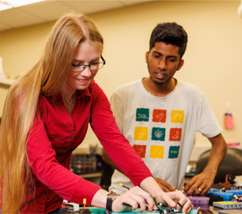
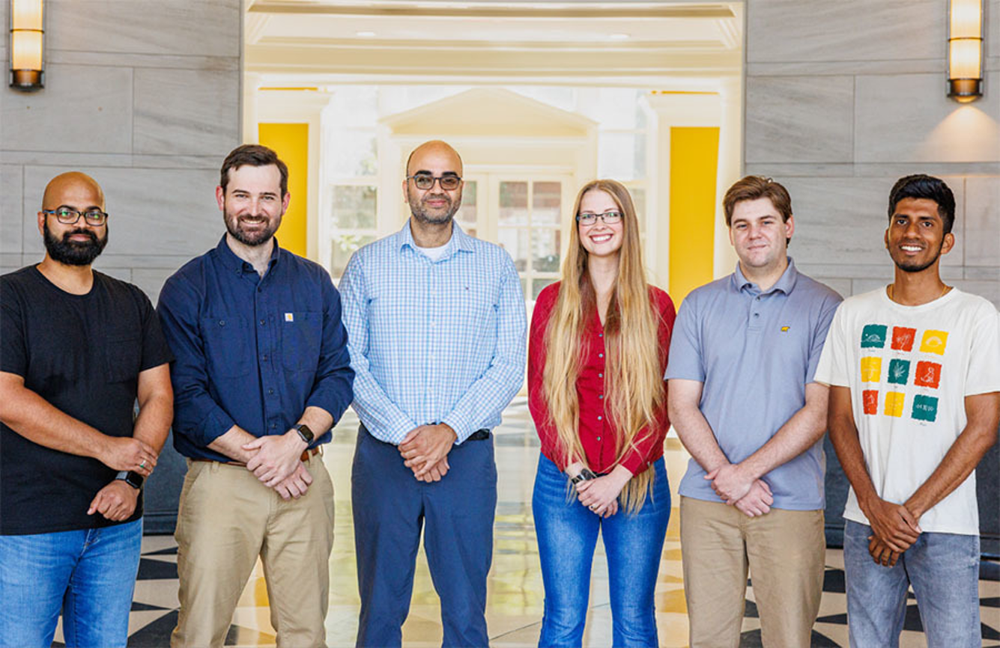

I'm a roboticist who builds autonomous systems that work reliably in the real world. My research sits at the 
intersection of robotics, deep learning, and hardware integration; from designing tensegrity robots that navigate 
unstructured terrain, to deploying computer vision models on edge devices for autonomous tracking. I'm particularly interested in understanding how we make increasingly capable autonomous systems safe, interpretable, and robust when they interact with the physical world.

I'm currently a Visiting Assistant Professor in the Electrical and Computer Engineering Department at Florida 
International University in Miami, Florida.  Since [joining the department](https://ece.fiu.edu/people/faculty/profiles/lauren-ervin/index1.html) in August 2025, I have been designing new robotics and 
computer vision courses, mentoring students, and leading research on embodied AI systems.  Recent 
projects I'm excited about include dynamic modeling of a tensegrity continuum manipulator with data-driven 
approaches, and reinforcement learning for challenging multi-agent tasks like cooperative lifting with miniature 
biped robots.

Before FIU, I completed my Ph.D. from the Electrical and Computer Engineering Department at the University of 
Alabama in August 2025.  During my time there, I worked across two labs: the [Agile Robotics Lab](https://sites.ua.edu/arl/), building and modeling tensegrity robots with non-intuitive behaviors, and the [Embedded and Robotic 
Systems Lab](https://ece.eng.ua.edu/laboratories/ersyl-embedded-and-robotic-systems-laboratory/), developing 
semantic segmentation pipelines for autonomous tracking on the edge and co-developing an open-source, multimodal 
dataset targeting vehicles.  My work has been recognized with awards including the Best 
Paper Award at the IEEE ICRA 2025 Soft Robotics for Space Applications Workshop, ECOB Electrical Engineering 
Graduate Student of the Year (2024), and three rounds of the NASA ASGC Fellowship (2022, 2023, and 2024).  I also held a TS/SCI clearance during my time as a co-op at the National Security Agency (2017-2019), where I worked on robotics and hardware design projects.

Feel free to reach out at Laurenefervin@gmail.com if you'd like to chat!  I'm also happy to share my resume/CV.

# Recent Publications

 

[Geometric Static Modeling Framework for Piecewise-Continuous Curved-Link 
Multi Point-of-Contact Tensegrity Robots](https://ieeexplore.ieee.org/abstract/document/10734217) 
**Lauren Ervin✉**,Vishesh Vikas. *<b>IEEE Robotics and Automation Letters</b>*, vol. 9, no. 12, pp. 
11066-11073, Dec. 2024, doi: 10.1109/LRA.2024.3486199. 

<a href="https://ieeexplore.ieee.org/abstract/document/10734217">IEEE RA-L </a>

 <a href="https://github.com/lefaris/TeXploR-geometric">Code</a> 

 

[Improving Grip Stability Using Passive Compliant Microspine Arrays for Soft Robots in Unstructured Terrain](https://ieeexplore.ieee.org/document/11128855) 
**Lauren Ervin✉**, Harish Bezawada, Vishesh Vikas. *<b>2025 IEEE International Conference on Robotics and Automation (ICRA), Atlanta, GA, USA, 2025</b>*, pp. 7872-7878, doi: 10.1109/ICRA55743.2025.11128855. 

<a href="https://ieeexplore.ieee.org/document/11128855">IEEE ICRA 2025 </a>

 <a href="https://github.com/lefaris/microspines">Code</a> 

 

[Evaluation of Semantic Segmentation Performance for a Multimodal Roadside Vehicle Detection System on the Edge](https://www.mdpi.com/1424-8220/25/2/370) 
**Lauren Ervin✉**, Max Eastepp, Mason McVicker, Kenneth Ricks. *<b>Sensors</b>*, 2025, 25, 370, doi: 10.3390/s25020370. 

<a href="https://www.mdpi.com/1424-8220/25/2/370">Sensors </a>

 <a href="https://github.com/UA-Roadside-Semantic-Segmentation/Multimodal-Roadside-Detection">Code</a>, <a 
href="https://doi.org/10.25452/figshare.plus.19311938.v1">Dataset</a> 

 

[Comparison of lidar semantic segmentation performance on the structured SemanticKITTI and off-road RELLIS-3D datasets](https://link.springer.com/article/10.1007/s41315-024-00376-5) 
Mason McVicker✉, **Lauren Ervin**, Yongzhi Yang, Kenneth Ricks. *<b>International Journal of Intelligent 
Robotics and Applications</b>*, 8, 1085–1101 (2024), doi: 10.1007/s41315-024-00376-5. 

<a href="https://link.springer.com/article/10.1007/s41315-024-00376-5">IJIRA </a>

 <a href="https://github.com/UA-Lidar-Segmentation-Research">Code</a> 

 

[UA_L-DoTT: University of Alabama’s large dataset of trains and trucks](https://www.sciencedirect.com/science/article/pii/S2352340922002840) 
Max Eastepp✉, **Lauren Faris**, Kenneth Ricks. *<b>Data in Brief</b>*, 2022, 42, 108073, doi: 10.1016/j.dib.2022.108073. 

<a href="https://www.sciencedirect.com/science/article/pii/S2352340922002840">Data in Brief </a>

 <a href="https://doi.org/10.25452/figshare.plus.19311938.v1">Dataset</a> 

# Media

My robot TeXploR was highlighted in [IEEE Spectrum's, "Coolest Robots at ICRA"](https://www.linkedin.com/posts/ieee-spectrum_icra-robot-robots-activity-7332741228989493248-e2no?utm_source=share&utm_medium=member_desktop&rcm=ACoAAB8lJRAB54u-d-imU761NIPa1vdVMqCX2KU)

 

ARL highlighted in the [UA Capstone Engineer 2024 Magazine](https://news.eng.ua.edu/capstone-engineer/)