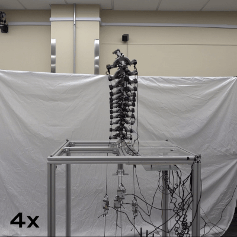
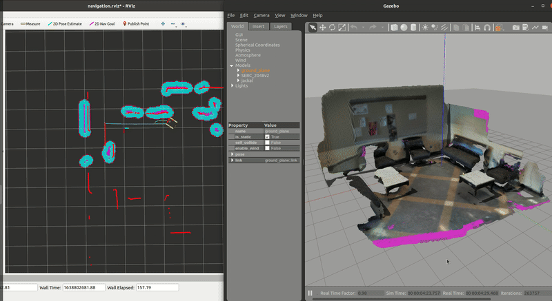

I'm a roboticist who builds autonomous systems for the real world - from tensegrity robots that can 
navigate unstructured terrain, to edge-deployed computer vision for autonomous tracking. My work sits at the 
intersection of robotics, deep learning, and systems integration. I'm particularly interested in understanding how we 
make increasingly capable autonomous systems safe, interpretable, and robust when they interact with the physical 
world. **I'm actively seeking industry R&D opportunities** where I can apply my expertise to build next-generation 
robotic systems. 

I'm currently a Visiting Assistant Professor in the Electrical and Computer Engineering Department at Florida 
International University in Miami, Florida.  Since [joining the department](https://ece.fiu.edu/people/faculty/profiles/lauren-ervin/index1.html) in August 2025, I have been designing new robotics and 
computer vision courses, mentoring students, and leading research on embodied AI systems.  Recent 
projects I'm excited about include dynamic modeling of a tensegrity continuum manipulator with data-driven 
approaches, and reinforcement learning for challenging multi-agent tasks like cooperative lifting with miniature 
biped robots.

## Featured Projects

  

    
    

      

        Featured
        
      

      

        <h3>TeXploR2 Robot</h3>
        
IEEE ICRA 2026

        

          System design of an improved curved-link tensegrity robot with non-intuitive locomotion.
        Expanded upon geometric modeling framework to include quasistatic simulations.
        

        

          MATLAB
          Vicon
          Raspberry Pi
          3D Printing
        

      

    

    
    

      

        In Progress
        
      

      

        <h3>Tensegrity Manipulator</h3>
        
Current Research

        

          System integration of tensegrity manipulator with motor-tendon actuators, in-line load cells, 
        and Vicon motion capture. Developing dynamic modeling using a modified RNEA algorithm with a data-driven 
        approach coming soon.
        

        

          MATLAB
          Jetson
          Load Cells
          Vicon
        

      

    

    

      

        Best Paper
        
      

      

        <h3>Compliant Microspines</h3>
        
IEEE ICRA 2025 | Patent Pending

        

          Novel mechanism design improving grip stability for soft robots on unstructured terrain. Won Best Paper Award at ICRA Space Robotics Workshop.
        

        

          Mechanism Design
          OpenCV
          Patent
        

      

    

    

      

        Simulation
        
      

      

        <h3>Jackal Gazebo Odometry</h3>
        
Clearpath Jackal

        

          Generated custom Gazebo worlds both inside labs and real-world outside environments.  Simulated Clearpath 
          Jackal robot in Gazebo and performed various navigation algorithms.
        

        

          ROS
          Gazebo
          Simulation
        

      

    

    
  

  
  <a href="/portfolio/" class="view-all-link">View All Projects →</a>

## Skills

  

    

      <h3>Programming</h3>
      

        Python
        MATLAB
        ROS
        C++
      

    

  

  

    

      <h3>DL/AI/CV</h3>
      

        TensorFlow
        Keras
        CNNs
        OpenCV
        RL
      

    

  

    
  

    

      <h3>Simulation</h3>
      

        Gazebo/RViz
        Isaac Sim/Lab
        MuJoCo
      

    

  

  

    

      <h3>Robotics Hardware</h3>
      

        NVIDIA Jetson
        Arduino
        RPi
        ESP32
        Clearpath Jackal
      

    

  

    
  

    

      <h3>Sensors</h3>
      

        LiDAR
        RGB/Stereo Camera
        IMU
        Vicon
        RTK GPS
        Load Cell
      

    

  

  

    

      <h3>Prototyping</h3>
      

        KiCAD
        OtherMill
        Soldering
        Fusion 360/SolidWorks
        FDM/SLA/Voxel8 Printers
        Injection Molding/Casting
        Water Jetting/Laser Cutting
      

    

  

    
  

    

      <h3>Tools</h3>
      

        Git
        Docker
        Linux
      

    

  

<!--

  
<strong>Looking for an industry robotics engineer?</strong> I bring end-to-end capabilities from hardware design to ML deployment, with a track record of building working systems. Previously held TS/SCI clearance at NSA (2017-2019).

-->

## Background

I completed my Ph.D. from the Electrical and Computer Engineering Department at the University of 
Alabama in August 2025.  During my time there, I worked across two labs: the [Agile Robotics Lab](https://sites.ua.edu/arl/), building and modeling tensegrity robots with non-intuitive behaviors, and the [Embedded and Robotic 
Systems Lab](https://ece.eng.ua.edu/laboratories/ersyl-embedded-and-robotic-systems-laboratory/), developing 
semantic segmentation pipelines for autonomous tracking on the edge and co-developing an open-source, multimodal 
dataset targeting vehicles.  My work has been recognized with awards including the Best 
Paper Award at the IEEE ICRA 2025 Soft Robotics for Space Applications Workshop, ECOB Electrical Engineering 
Graduate Student of the Year (2024), and three rounds of the NASA ASGC Fellowship (2022, 2023, and 2024).  I also 
held a TS/SCI clearance during my time as a co-op at the Department of Defense (2017-2019), where I worked on robotics 
and hardware design projects.

**Key Achievements:**
- **Best Paper Award** - IEEE ICRA 2025 Soft Robotics for Space Workshop
- **Featured in IEEE Spectrum** - "Coolest Robots at ICRA" (2025)
- **NASA ASGC Fellowship** - 3 independent rounds (2022-2025)
- **ECOB EE Graduate Student of the Year** (2024)
- **NSF iREDEFINE Award** (2024)
- **2nd Place Best Poster Award** - UA ECE Grad Poster Competition (2024)
- **NSF BPart Fellowship** (2023)
- **1st Place Best Poster Award** - UA ECE Grad Poster Competition (2023)
- **NSF LIA Scholarship** 2018-2020
- **UA Engineering Scholarship** (2016-2020)
- **TS/SCI Clearance** - DoD (2017-2019)

## Recent Publications

 

[Improving Grip Stability Using Passive Compliant Microspine Arrays for Soft Robots in Unstructured Terrain](https://ieeexplore.ieee.org/document/11128855) 
**Lauren Ervin✉**, Harish Bezawada, Vishesh Vikas. *<b>2025 IEEE International Conference on Robotics and Automation (ICRA), Atlanta, GA, USA, 2025</b>*, pp. 7872-7878, doi: 10.1109/ICRA55743.2025.11128855. 

<a href="https://ieeexplore.ieee.org/document/11128855">IEEE ICRA 2025 </a>

 <a href="https://github.com/lefaris/microspines">Code</a> 

 

[Geometric Static Modeling Framework for Piecewise-Continuous Curved-Link Multi Point-of-Contact Tensegrity Robots](https://ieeexplore.ieee.org/abstract/document/10734217) 
**Lauren Ervin✉**,Vishesh Vikas. *<b>IEEE Robotics and Automation Letters</b>*, vol. 9, no. 12, pp. 11066-11073, Dec. 2024, doi: 10.1109/LRA.2024.3486199. 

<a href="https://ieeexplore.ieee.org/abstract/document/10734217">IEEE RA-L </a>

 <a href="https://github.com/lefaris/TeXploR-geometric">Code</a> 

 

[Evaluation of Semantic Segmentation Performance for a Multimodal Roadside Vehicle Detection System on the Edge](https://www.mdpi.com/1424-8220/25/2/370) 
**Lauren Ervin✉**, Max Eastepp, Mason McVicker, Kenneth Ricks. *<b>Sensors</b>*, 2025, 25, 370, doi: 10.3390/s25020370. 

<a href="https://www.mdpi.com/1424-8220/25/2/370">Sensors </a>

 <a href="https://github.com/UA-Roadside-Semantic-Segmentation/Multimodal-Roadside-Detection">Code</a>, <a href="https://doi.org/10.25452/figshare.plus.19311938.v1">Dataset</a> 

<a href="/publications/" class="view-all-link">View All Publications →</a>