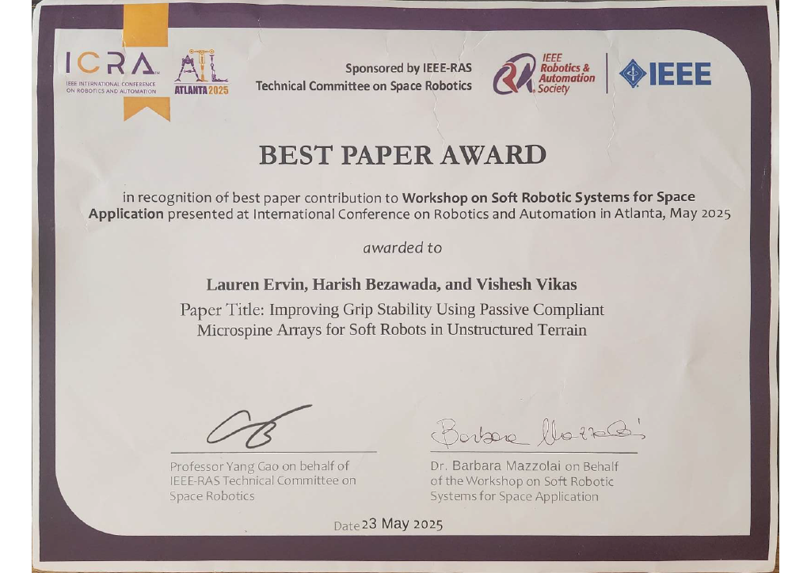
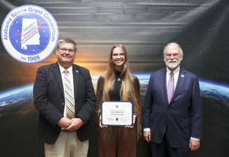
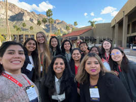
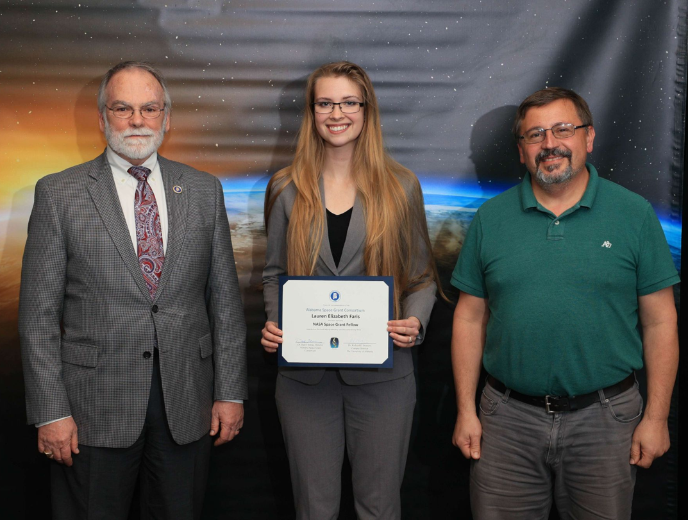
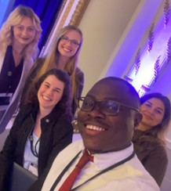
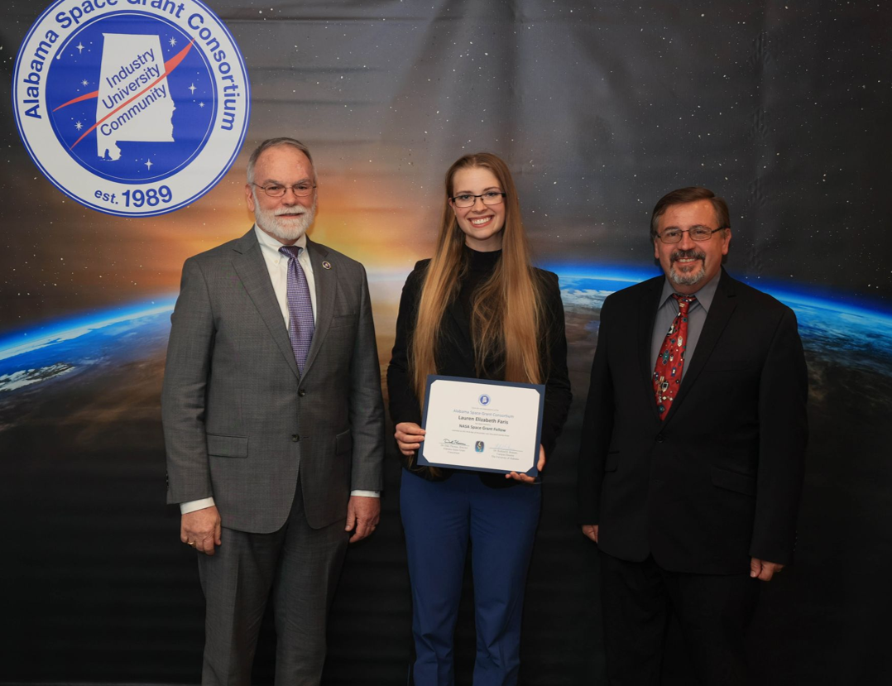

## Best Paper Award at IEEE ICRA 2025 Soft Robotics for Space Applications Workshop - May 2025

## NASA ASGC Fellowship Renewal #2 - 2024-2025

## NSF Impact: Redefining Electrical and Computer Engineering Faculty (iREDEFINE) Award - January 2024

## Engineering Council of Birmingham (ECOB) Electrical Engineering Graduate Student of the Year - January 2024

## NASA ASGC Fellowship Renewal #1 - 2023-2024

## NSF Broadening Participation (BPart) Fellowship - June 2023

## NASA ASGC Fellowship - 2022-2023

## NSF Learning in Advance Scholarship - 2018-2020

## University of Alabama Foundations of Excellence Scholarship - 2016-2020

## University of Alabama Engineering Scholarship - 2016-2020

