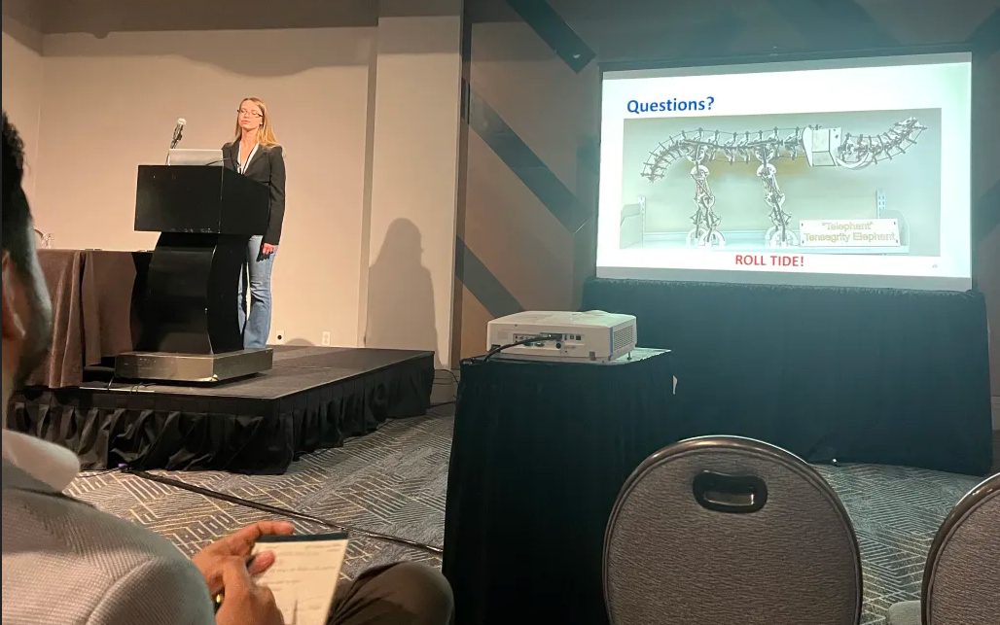

[IDETC DexTeR presentation slides here](https://lefaris.github.io/files/IDETC_DexTeR.pdf)

I gave a talk for a fellow ARL member that was not able to attend IDETC 2023.  This talk discussed the overall 
design framework of a tensegrity continuum manipulator, which I later extended.

