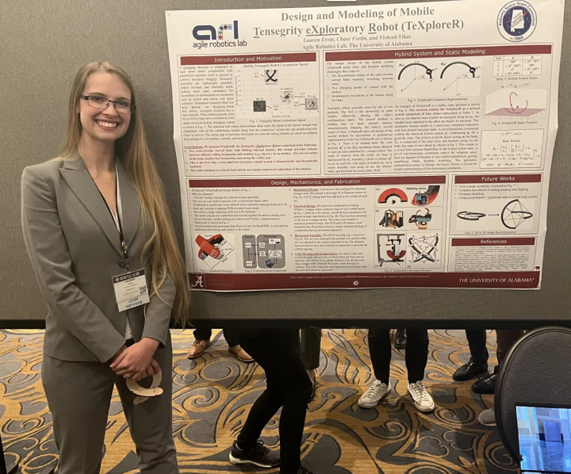

[TeXploR static modeling poster link here](https://lefaris.github.io/files/TeXploreR_IDETC_2023.pdf)

I am grateful for receiving the [NSF BPart Fellowship](https://lefaris.github.io//awards/) which allowed me to 
present my work on static modeling of a mobile, rolling tensegrity robot at IDETC 2023.

