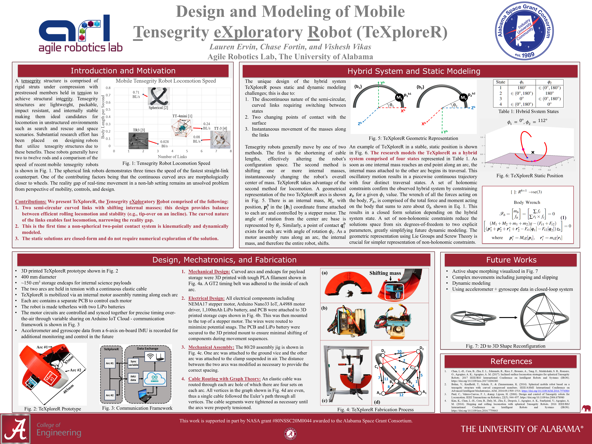

[TeXploR poster link here](https://lefaris.github.io/files/TeXploreR_IDETC_2023.pdf)

I presented my work on static modeling of a rolling tensegrity robot in the first UA ECE graduate student poster 
competition in December 2023 and was lucky enough to win 1st place.

