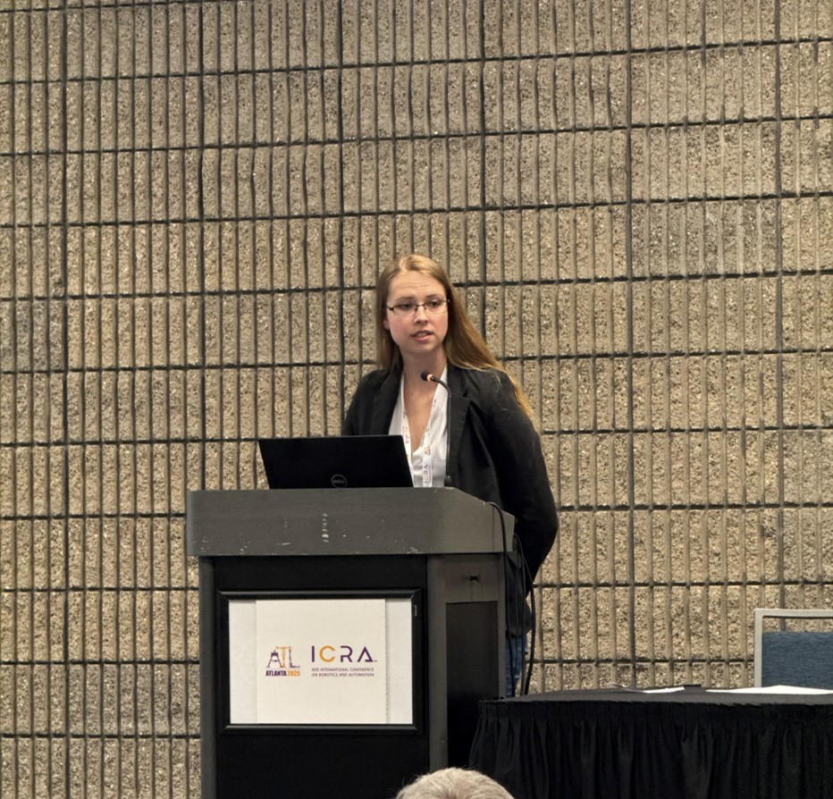

[Microspines talk slides link here](https://lefaris.github.io/files/microspines_ICRA_presentation_slides.pdf)

I had the joy of presenting my [microspines paper](https://lefaris.github.io//publication/2025-05-20-Passive-Compliant-Microspine-Arrays) at ICRA 2025. 

