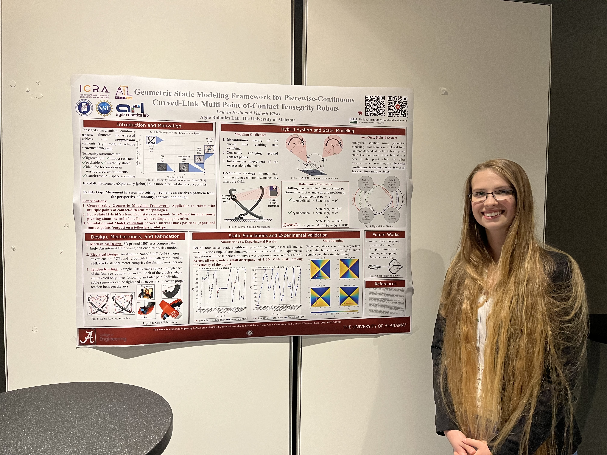

[TeXploR talk slides link here](https://lefaris.github.io/files/TeXploR_ICRA_presentation_slides.pdf)

I had the joy of presenting my [geometric modeling paper (published in IEEE RA-L)](https://lefaris.github.io//publication/2024-10-24-Geometric-Static-Modeling-Framework) at ICRA 2025. 

