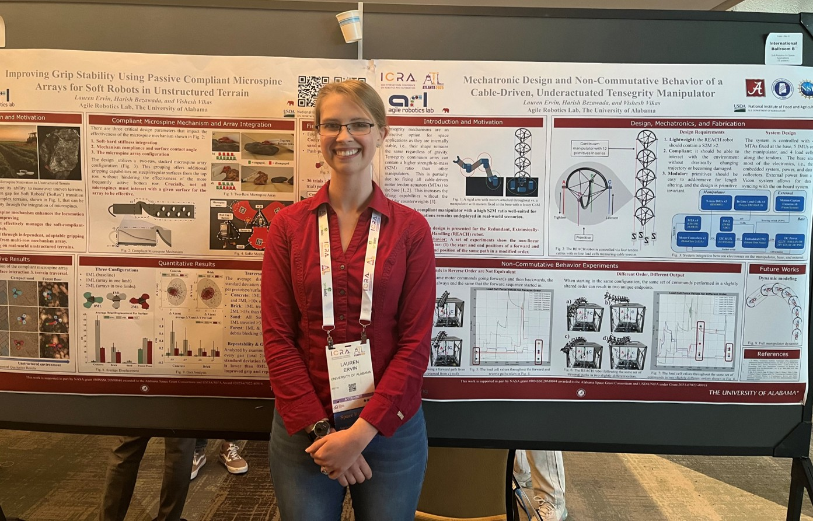

[Manipulator poster link here](https://lefaris.github.io/files/REACH_ICRA_poster.pdf)

[Microspines poster link here](https://lefaris.github.io/files/microspines_ICRA_poster.pdf)

At the [IEEE ICRA 2025 Soft Robots for Space Applications workshop](https://softroboticsforspace.eu/), I had the joy 
of presenting two posters based off paper submissions describing my research focused on mobile space robots.  I even 
had the fortune of receiving the IEEE/RAS sponsored [Best Paper Award](https://softroboticsforspace.eu/best-paper-award) for 
my paper:
> Improving Grip Stability Using Passive Compliant Microspine Arrays for Soft Robots in Unstructured 
Terrain

I even had the pleasure of discussing my design with the distinguished [Mark Cutkosky](https://scholar.google.com/citations?user=qIg8KFYAAAAJ&hl=en) who greatly inspired my work.

